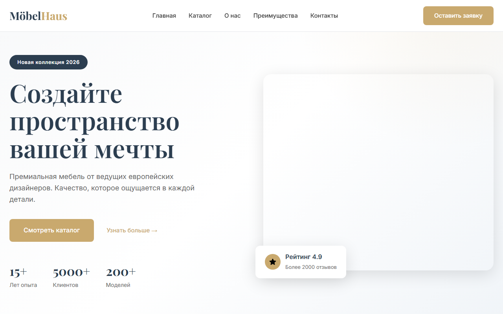
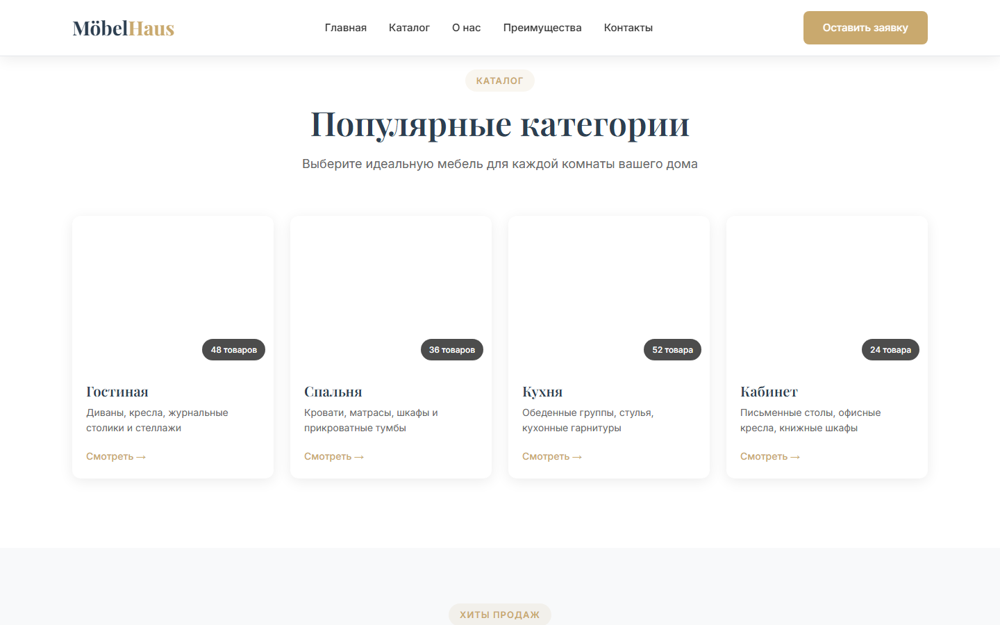
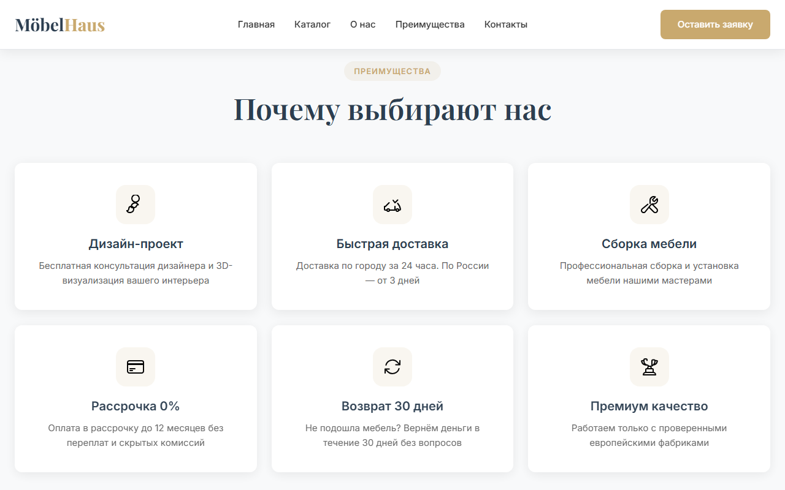
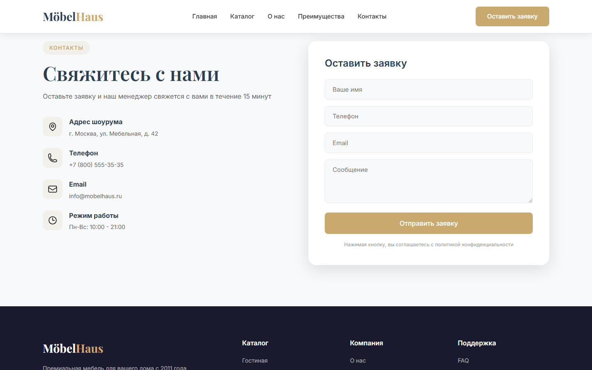

# MöbelHaus — Лендинг мебельного магазина

Современный адаптивный лендинг для премиального мебельного магазина. Создан с использованием чистого HTML, CSS и JavaScript без фреймворков.

## Демо

🌐 [Посмотреть демо](https://nnnekita.github.io/furniture-landing-sample/)

## Скриншоты

### Главная страница


### Каталог


### Преимущества


### Контакты


## Технологии

- **HTML5** — семантическая разметка
- **CSS3** — Grid, Flexbox, CSS Variables, анимации, адаптивный дизайн
- **JavaScript** — Intersection Observer, плавный скролл, мобильное меню, обработка форм
- **SVG-иконки** — кастомные иконки без зависимостей

## Структура проекта

```
furniture-landing/
├── index.html          # Главная страница
├── styles.css          # Стили
├── script.js           # Интерактивность
├── icons/              # SVG-иконки
│   ├── design.svg
│   ├── delivery.svg
│   ├── assembly.svg
│   ├── installment.svg
│   ├── return.svg
│   ├── quality.svg
│   ├── location.svg
│   ├── phone.svg
│   ├── email.svg
│   ├── clock.svg
│   ├── check.svg
│   ├── star.svg
│   ├── vk.svg
│   ├── telegram.svg
│   └── youtube.svg
└── screenshots/        # Скриншоты для README
```

## Секции лендинга

1. **Шапка** — фиксированная навигация с эффектом при скролле
2. **Hero** — главный экран с CTA и статистикой
3. **Каталог** — 4 категории мебели с карточками
4. **Популярные товары** — карточки товаров с ценами и скидками
5. **О компании** — информация и преимущества
6. **Почему выбирают нас** — 6 карточек с иконками
7. **Отзывы** — отзывы клиентов с рейтингом
8. **Контакты** — контактная информация и форма заявки
9. **Футер** — навигация и социальные сети

## Особенности

- Полностью адаптивный дизайн (мобильные, планшеты, десктоп)
- Плавные анимации при скролле (Intersection Observer)
- Фиксированная шапка с blur-эффектом
- Мобильное меню-бургер
- Форма обратной связи с визуальным подтверждением отправки
- Кастомные SVG-иконки без внешних зависимостей
- Шрифты Google Fonts (Playfair Display + Inter)

## Запуск

Просто откройте `index.html` в браузере:

```bash
# Или запустите локальный сервер
npx serve .
```
